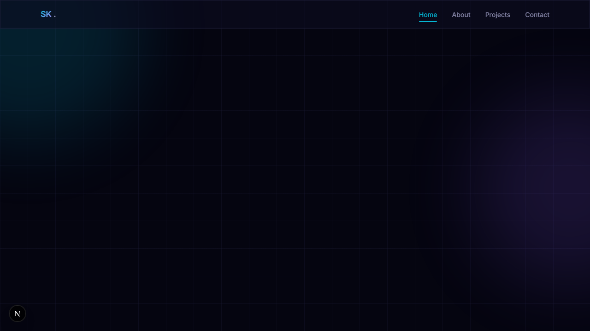
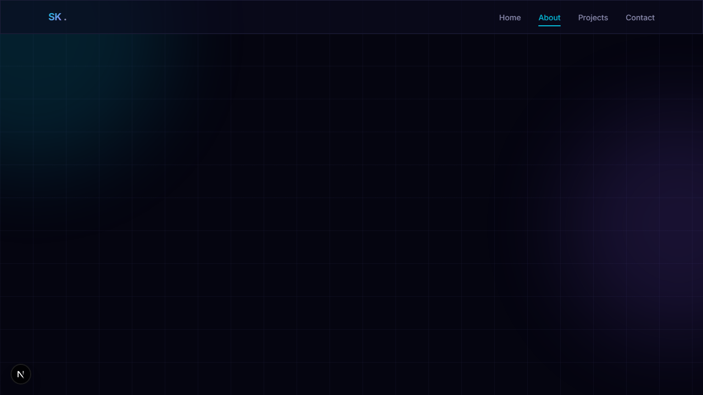

# Shahabas K M — Portfolio

A minimal, dark-themed personal portfolio built with **Next.js**, **Tailwind CSS**, and **TypeScript**. Designed to showcase data science and machine learning projects with a clean, premium aesthetic.


---

### Screenshots
<div align="center">
  
  
</div>

---

## ✨ Features

- **Dark mode** — elegant, developer-focused design with a cyan accent
- **Responsive** — mobile-first layout that works perfectly on all devices with hardware-accelerated scrolling
- **Animated** — smooth fade-in and hover animations via Framer Motion, optimized for varying screen sizes
- **SEO optimized** — meta tags, Open Graph, and semantic HTML
- **Comprehensive** — includes sections for Bio, Core Competencies, Educational Qualifications, and Featured Projects
- **Accessible** — ARIA labels, keyboard navigation, and proper heading hierarchy
- **Fast** — optimized for Core Web Vitals on Vercel

## 🛠 Tech Stack

| Layer | Technology |
|-------|-----------|
| Framework | [Next.js 16](https://nextjs.org/) (App Router) |
| Styling | [Tailwind CSS 4](https://tailwindcss.com/) |
| Language | [TypeScript 5](https://www.typescriptlang.org/) |
| Animations | [Framer Motion](https://www.framer.com/motion/) |
| Hosting | [Vercel](https://vercel.com/) |

## 📁 Project Structure

```
├── app/                  # Next.js App Router pages
│   ├── layout.tsx        # Root layout with metadata
│   ├── page.tsx          # Home (hero section)
│   ├── about/            # About page
│   ├── projects/         # Projects page
│   └── contact/          # Contact page
├── components/           # Reusable UI components
│   ├── Navbar.tsx
│   ├── Footer.tsx
│   ├── ProjectCard.tsx
│   ├── AnimatedSection.tsx
│   ├── SectionHeading.tsx
│   └── SkillBadge.tsx
├── content/
│   └── projects.json     # Project data (easy to update)
├── lib/
│   └── types.ts          # TypeScript interfaces
└── public/               # Static assets
```

## 🚀 Getting Started

### Prerequisites

- [Node.js](https://nodejs.org/) 18.x or later
- npm (comes with Node.js)

### Installation

```bash
# Clone the repository
git clone https://github.com/shahabaskm/portfolio-.git
cd portfolio-

# Install dependencies
npm install

# Start the development server
npm run dev
```

Open [http://localhost:3000](http://localhost:3000) in your browser.

### Build for Production

```bash
npm run build
npm start
```

## 🌐 Deployment (Vercel)

This project is optimized for [Vercel](https://vercel.com/):

1. Push your code to GitHub
2. Go to [vercel.com/new](https://vercel.com/new)
3. Import your GitHub repository
4. Click **Deploy** — no configuration needed

Vercel will automatically detect Next.js and deploy.

## ✏️ Customization

### Update Projects

Edit `content/projects.json` to add, remove, or modify projects:

```json
{
  "id": "my-project",
  "title": "Project Title",
  "description": "A brief description of the project.",
  "techStack": ["Python", "PyTorch"],
  "githubUrl": "https://github.com/username/repo",
  "liveUrl": "https://demo.example.com",
  "featured": true
}
```

### Update Personal Info

- **Name & role**: `app/page.tsx`
- **Bio & skills**: `app/about/page.tsx`
- **Email & socials**: `app/contact/page.tsx` and `components/Footer.tsx`
- **SEO metadata**: `app/layout.tsx`

## 📄 License

This project is open source under the [MIT License](LICENSE).

---

Built with ☕ by [Shahabas K M](https://github.com/shahabaskm)
